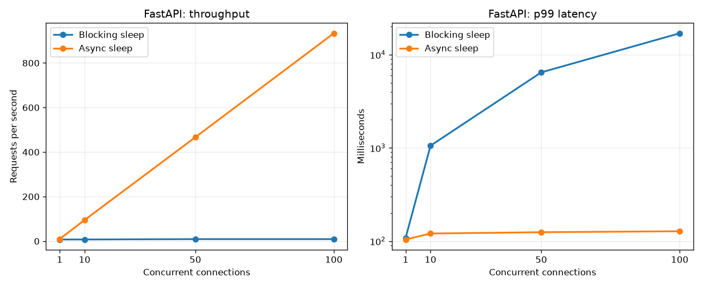
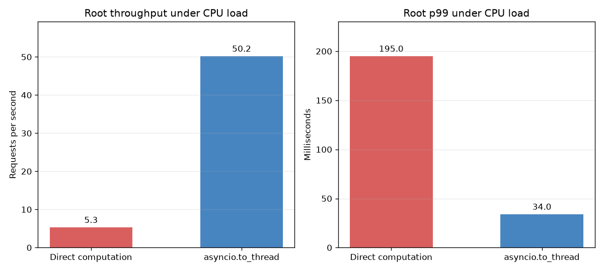
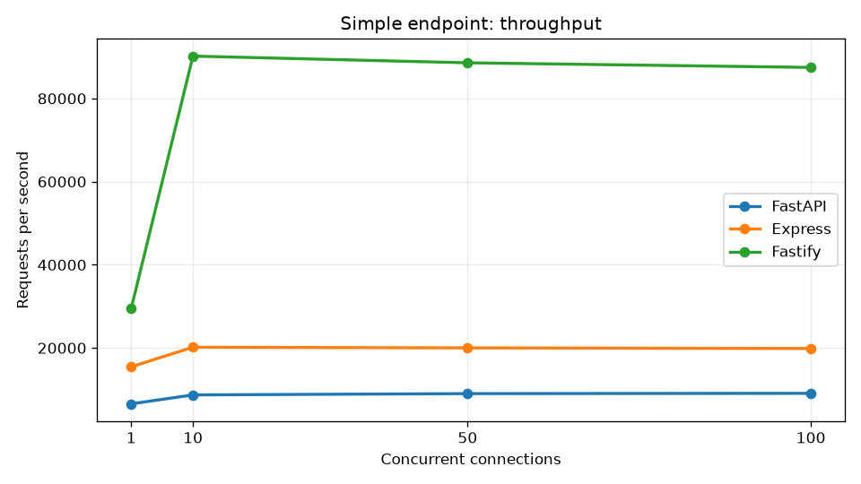

# Выводы по нагрузочному тестированию REST API

В проекте реализованы маршруты из [блокнота занятия](https://colab.research.google.com/drive/1RtICYQT8v2ZVflrfwC58eKtx68H9gryk#scrollTo=R3n1935kZ-Jv) на FastAPI и сопоставимые маршруты на Express и Fastify. Числа ниже взяты из `results.json`; тесты запускает `benchmark.js` с помощью `autocannon`. Для каждого сочетания фреймворка, маршрута и числа соединений выполнено два прогона. В таблицах приведено среднее по двум прогонам; p99 также усреднён по прогонам, а не рассчитан заново по всем запросам.

## Блокирующее ожидание и асинхронная пауза

`/slow_endpoint` занимает примерно 100 мс на запрос и блокирует цикл событий (`time.sleep` в FastAPI, активное ожидание в Node.js). При увеличении числа соединений пропускная способность остаётся около 9–10 запросов/с, зато очередь растёт. У FastAPI при 100 соединениях p99 достиг 16,98 с. `/slow_endpoint_fixed` использует неблокирующее ожидание: при той же нагрузке FastAPI обработал около 933 запросов/с с p99 128 мс.

| Фреймворк | `/slow_endpoint`: RPS при 100 соединениях | `/slow_endpoint`: p99, мс | `/slow_endpoint_fixed`: RPS | `/slow_endpoint_fixed`: p99, мс |
| --- | ---: | ---: | ---: | ---: |
| FastAPI | 9,1 | 16 979 | 933,3 | 128 |
| Express | 9,7 | 11 310 | 924,2 | 134 |
| Fastify | 10,0 | 12 658 | 960,2 | 120 |

На графике p99 показан в логарифмической шкале, чтобы обе кривые оставались различимыми.

Для блокирующего маршрута Express при 100 соединениях зафиксировано 35 и 37 ошибок соединения в двух прогонах; у остальных приведённых сценариев ошибок, таймаутов и ответов вне 2xx не было. Сравнение p99 у блокирующего маршрута следует читать с учётом разной длительности прогонов: тест с заданным числом запросов завершался за 17–22 с вместо обычных 3 с.

## `high_cpu_endpoint` и `high_cpu_endpoint_fixed`

Оба маршрута вычисляют одну и ту же сумму в цикле из 10 млн итераций. Обычный `high_cpu_endpoint` выполняет цикл прямо в `async`-обработчике и удерживает цикл событий. В `high_cpu_endpoint_fixed` вычисление передано в `asyncio.to_thread`: во время выполнения задачи сервер может отвечать на другие запросы.

Измерение проводилось при одновременной нагрузке на CPU-маршрут и `/`, по одному соединению на каждый маршрут. Данные — средние по двум пятисекундным прогонам FastAPI с одним процессом Uvicorn.

| Вариант CPU-маршрута | CPU-маршрут, RPS | `/`, RPS | `/`, средняя задержка, мс | `/`, p99, мс |
| --- | ---: | ---: | ---: | ---: |
| `high_cpu_endpoint` | 5,3 | 5,3 | 185,0 | 195 |
| `high_cpu_endpoint_fixed` | 5,2 | 50,2 | 19,5 | 34 |

Таким образом, исправление повышает отзывчивость **других** маршрутов примерно в 9,5 раза по RPS и снижает их p99 с 195 до 34 мс. Сама CPU-задача не ускоряется: около 5,3 и 5,2 RPS соответственно. Поток освобождает цикл событий, но не превращает вычисление на чистом Python в параллельное исполнение на нескольких ядрах из-за GIL. Для ускорения таких вычислений нужны отдельные процессы или иной исполнитель, а результат следует проверять отдельным тестом.

## Сравнение фреймворков

На простом маршруте `/` при 10 соединениях средняя пропускная способность составила 8 703 RPS у FastAPI, 20 173 RPS у Express и 90 197 RPS у Fastify. Это измерение накладных расходов конкретных реализаций на данной машине, а не универсальный рейтинг фреймворков. При маршруте с неблокирующей паузой в 100 мс результаты при 100 соединениях сблизились: 924–960 RPS. Ограничителем здесь стала заданная задержка, а не скорость обработки пустого ответа.

| Соединения | FastAPI `/`, RPS | Express `/`, RPS | Fastify `/`, RPS |
| ---: | ---: | ---: | ---: |
| 1 | 6 548 | 15 456 | 29 440 |
| 10 | 8 703 | 20 173 | 90 197 |
| 50 | 9 012 | 20 016 | 88 587 |
| 100 | 9 084 | 19 872 | 87 477 |

## Принципы стресс-тестирования

1. Сравнивать одинаковые сценарии: один и тот же маршрут, число соединений, длительность и формат ответа. Блокирующую и неблокирующую операции измерять отдельно, затем проверять их совместное влияние.
2. Повышать нагрузку ступенями и смотреть одновременно на RPS, среднюю задержку, p99, ошибки и таймауты. Плато RPS при росте задержки означает, что сервер достиг предела для данного сценария.
3. Прогревать сервер и повторять измерения; фиксировать версии, число воркеров, конфигурацию машины и параметры генератора нагрузки. В текущих результатах по два коротких прогона, а характеристики машины не сохранены, поэтому небольшие различия нельзя считать устойчивыми.
4. Не блокировать цикл событий ожиданием или вычислением. Асинхронное ожидание помогает при I/O-подобных задачах; для CPU-задачи отдельно проверять отзывчивость других маршрутов и реальную пропускную способность вычисления.
